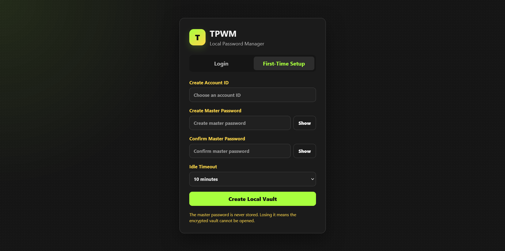
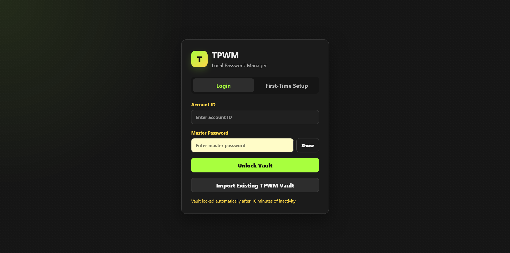
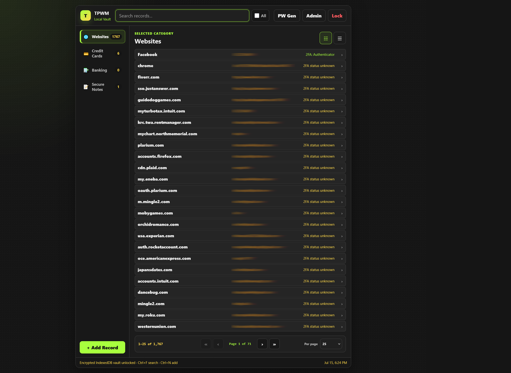
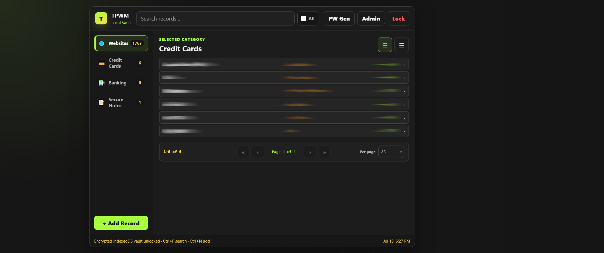
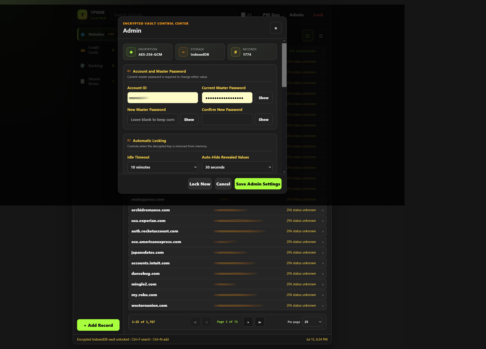

# TPWM Total Password Wallet Manager

 **⚠️ Firefox Add-on Status**

 The Firefox Add-on is currently **PENDING** keep watch.

 TPWM remains an active open-source project, and development continues.

## Overview

TPWM (Total Password Wallet Manager) is a privacy-first password manager designed for users who want complete control over their passwords.

Unlike cloud-based password managers, TPWM stores your encrypted vault locally on your computer. No accounts, no subscriptions, no cloud synchronization, and no telemetry.

## Download

📥 **Latest Release**

https://github.com/klyxmaster/TPWM/releases/latest

## Features

- AES-GCM encrypted password vault
- PBKDF2 master password protection
- One-click Firefox Click-to-Fill
- Password generator
- Search and organize credentials
- Secure notes
- Import and export TPWM vaults
- Local encrypted storage
- No cloud services
- No advertisements
- No tracking
- No telemetry

## Why TPWM?

Many password managers require online accounts, subscriptions, or cloud synchronization.

TPWM was created with a different philosophy:

- Your passwords belong to you.
- Your vault stays on your device.
- You decide when data is exported.
- No company has access to your vault.

## Security

TPWM uses modern encryption techniques including:

- AES-GCM encryption
- PBKDF2 key derivation
- Local encrypted vault storage
- Master password authentication

The extension never intentionally uploads vault contents to external servers.

## Installation

### Firefox

1. Install TPWM from Firefox Add-ons (once approved)

or

Download the latest release from GitHub.

### Temporary Installation

1. Open about:debugging
2. Load Temporary Add-on
3. Select manifest.json

Install directly from Mozilla Add-ons once approved.

Or install manually:

1. Download the latest release.
2. Open Firefox.
3. Visit `about:debugging`.
4. Select **This Firefox**.
5. Choose **Load Temporary Add-on**.
6. Select `manifest.json`.
## Screenshots

### First Run Setup

### Login Screen

### Website Manager

### Credit Card Vault

### Administration

## Planned Features

- Multiple accounts per website
- Chrome support
- Edge support
- Automatic vault backup
- TOTP improvements
- Additional import formats
- UI themes

## Contributing

Suggestions, bug reports, and feature requests are welcome.

## License

Released under the MIT License.

---

Created by **Rick Scorpio**

Privacy First. Local First.
